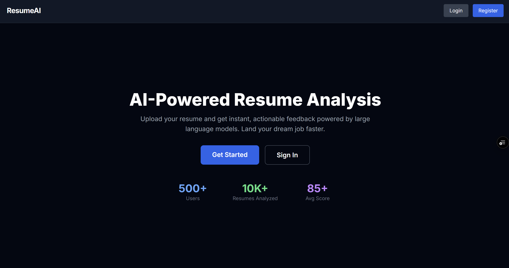
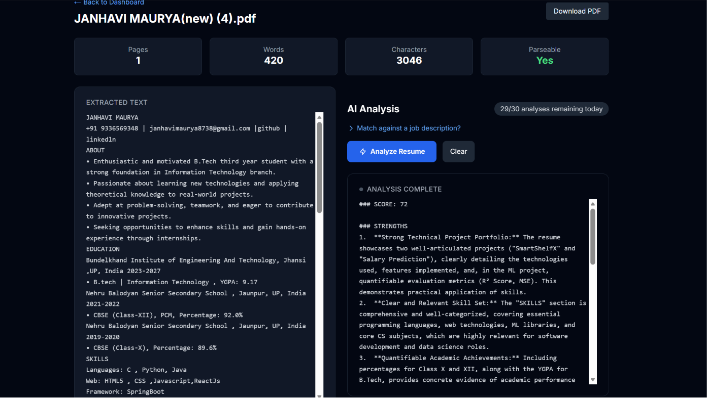

# 🚀 ResumeAI - AI Powered Resume Analysis Platform

ResumeAI is a full-stack AI-powered web application that helps users analyze their resumes and receive personalized feedback using Google Gemini AI.

## 🌐 Live Demo

🔗 https://resume-analyzer-ai-weld.vercel.app

---

## ✨ Features

- 🔐 Email & Google Authentication
- 🔑 JWT Access & Refresh Tokens
- 📄 Resume Upload & Management
- ☁️ Cloudinary File Storage
- 🤖 AI-Powered Resume Analysis with Google Gemini
- 📊 Dashboard with Usage Analytics
- 📱 Responsive UI
- ⚡ FastAPI + Next.js Full Stack Architecture

---

## 🛠 Tech Stack

### Frontend
- Next.js
- TypeScript
- Tailwind CSS
- NextAuth

### Backend
- FastAPI
- SQLAlchemy

### Database
- PostgreSQL (Supabase)
- MongoDB Atlas

### Storage
- Cloudinary

### AI
- Google Gemini API

### Deployment
- Vercel
- Railway

---

## 📂 Project Structure

```
resume-analyzer-ai
│
├── frontend
│   ├── src
│   ├── components
│   ├── app
│   └── ...
│
├── backend
│   ├── app
│   ├── routes
│   ├── models
│   ├── schemas
│   └── ...
```

---

## 📸 Screenshots

### Home Page



### Dashboard


### Resume Upload


### AI Analysis



### Score Trend Chart


---

## 🔑 Authentication Flow

- Email Login
- Google OAuth
- JWT Access Token
- Refresh Token Mechanism

---

## 💡 Key Learnings

- OAuth Authentication
- JWT Token Management
- FastAPI API Development
- PostgreSQL with SQLAlchemy
- Cloudinary Integration
- CORS Handling
- Railway & Vercel Deployment
- Debugging Real-world Issues

---

## 👩‍💻 Author

### Janhavi Maurya

🔗 LinkedIn: www.linkedin.com/in/janhavi-maurya-90ba0a271

🔗 GitHub: https://github.com/janhavi-2011

---
..

